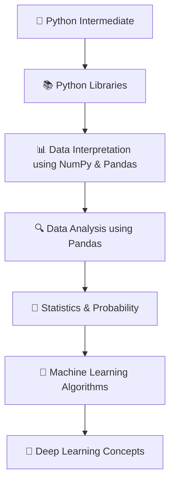

# 🤖 Machine Learning Internship & Training

Welcome to my **Machine Learning Internship & Training** repository! This repository documents my step-by-step learning journey, algorithm implementations, and real-world projects completed during my training and internship at **I Studio**.

---

## 📌 Table of Contents
- [📖 About the Journey](#-about-the-journey)
- [📈 Learning Pathway](#-learning-pathway)
- [🛠️ Tech Stack & Libraries](#️-tech-stack--libraries)
- [📜 Certificates](#-certificates)
- [📂 Repository Structure](#-repository-structure)
- [🚀 Quick Start](#-quick-start)
- [📫 Connect with Me](#-connect-with-me)

---

## 📖 About the Journey

This repository highlights hands-on experience gained across fundamental and advanced Data Science, Artificial Intelligence, and Machine Learning concepts. It tracks the complete progression from foundational core programming to complex model development and implementation.

---

## 📈 Learning Pathway

My structured learning flow during the program followed this roadmap:



1. **Python Intermediate**: Object-Oriented Programming (OOP), functional programming, modules, error handling, and clean coding practices.
2. **Python Libraries**: Core ecosystem tools including NumPy, Pandas, Scikit-Learn, Matplotlib, and Seaborn.
3. **Data Interpretation (NumPy & Pandas)**: Multidimensional arrays, matrix operations, indexing, filtering, and structural dataset manipulation.
4. **Data Analysis (Pandas)**: Data cleaning, missing value treatment, feature transformation, aggregation, and Exploratory Data Analysis (EDA).
5. **Statistics & Probability**: Descriptive & inferential statistics, probability distributions, hypothesis testing, correlation, and variance.
6. **Machine Learning Algorithms**: Supervised and Unsupervised learning methods (Regression, Classification, Clustering, Evaluation Metrics).
7. **Deep Learning Concepts**: Neural network architecture foundations, activation functions, loss functions, and optimization techniques.

---

## 🛠️ Tech Stack & Libraries

* **Core Language**: Python 🐍
* **Environment**: Jupyter Notebook 📓
* **Data Manipulation & Analysis**: NumPy, Pandas
* **Data Visualization**: Matplotlib, Seaborn
* **Machine Learning**: Scikit-Learn

---

## 📜 Certificates

### 🎓 Training Certificate


---

### 💼 Internship Certificate


---

## 📂 Repository Structure

```text
.
├── 📁 Project/               # End-to-end Machine Learning projects & capstones
├── 📁 Training/              # Hands-on training notebooks, exercises & practice
├── 📁 assets/                # Certificates and visualization images
└── 📄 README.md              # Project documentation

```

---

## 🚀 Quick Start

To run the notebooks locally:

1. **Clone the repository**:
```bash
git clone [https://github.com/sonakshipundir6-pixel/Machine-Learning---Internship-.git](https://github.com/sonakshipundir6-pixel/Machine-Learning---Internship-.git)

```


2. **Navigate into the directory**:
```bash
cd Machine-Learning---Internship-

```


3. **Install required dependencies**:
```bash
pip install numpy pandas matplotlib seaborn scikit-learn jupyter

```


4. **Launch Jupyter Notebook**:
```bash
jupyter notebook

```


---

## 📫 Connect with Me

* **GitHub**: [@sonakshipundir6-pixel](https://github.com/sonakshipundir6-pixel?utm_source=gemini)
* **Organization**: I Studio

```

---
